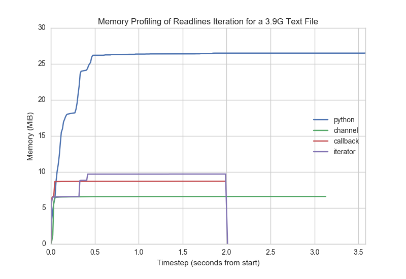

# File Iteration Benchmarks  

[](https://travis-ci.org/bbengfort/iterfile)
[](https://goreportcard.com/report/github.com/bbengfort/iterfile)
[](https://godoc.org/github.com/bbengfort/iterfile)

[](https://flic.kr/p/iaVByW)

**Benchmarking for various file iteration utilities**

This small library provides various mechanisms for reading a file one line at a time. These utilities aren't necessarily meant to be used as a library for use in production code  (though you're more than welcome to) but rather to profile and benchmark various iteration constructs. See [Benchmarking Readline Iterators](https://bbengfort.github.io/programmer/2016/12/22/benchmarking-readlines.html) for a complete post about this repository.

> Read more at [Benchmarking Readline Iterators](https://bbengfort.github.io/programmer/2016/12/22/benchmarking-readlines.html) and [Yielding Functions for Iteration in Go](http://bbengfort.github.io/snippets/2016/12/22/yielding-functions-for-iteration-golang.html).

## Usage

All of the functions in this library are `Readlines` functions; that is they take as input at least the path to a file, and then provide some iterable context with which to handle one line of the file at a time. The examples for usage here will simply be a line character count (less the newlines), the testing methodology uses line, word, and character counts. Currently we have implemented:

- `ChanReadlines`: returns a channel to `range` on.
- `CallbackReadlines`: accepts a per-line callback function.
- `IteratorReadlines`: returns a stateful iterator.

### Channel Readlines

Use the channel based readlines iterator as follows:

```go
// construct the reader and the line count.
var chars int
reader, err := ChanReadlines("fixtures/small.txt")

// check if there was an error opening the file or scanning.
if err != nil {
    log.Fatal(err)
}

// iterate over the lines using range
for line := range reader {
    chars += len(line)
}
```

Variants of this reader would not require the error checking at the beginning, but would rather yield errors in iteration along with the line.

### Callback Readlines

Use the callback-style readlines iterator as follows:

```go
var chars int

// Define the callback function
cb := func(line string) error {
    chars += len(line)
    return nil
}

// Pass the callback to the iterator
err := CallbackReadlines("fixtures/small.txt", cb)
if err != nil {
    log.Fatal(err)
}
```

Note that in this mechanism, you can `break` out of the loop by returning an
error from the callback, which will cause the calling iterator to return and
hopefully also close the file and be done!

## Iterator Readlines

Use the stateful iterator returned by the readlines iterator as follows:

```go
var chars int
reader, err := IteratorReadlines("fixtures/small.txt")

// check if there was an error opening the file or scanning.
if err != nil {
    log.Fatal(err)
}

// iterate over the stateful LineIterator that has been returned.
for reader.Next() {
    chars += len(reader.Line())
}
```

## Benchmarks

Benchmarks can be run with the `go test -bench=.` command. The current benchmarks are as follows:

```
BenchmarkChanReadlinesSmall-8         	   20000	     74958 ns/op
BenchmarkChallbackReadlinesSmall-8    	   50000	     28836 ns/op
BenchmarkIteratorReadlinesSmall-8     	   50000	     29006 ns/op

BenchmarkChanReadlinesMedium-8        	    2000	    621716 ns/op
BenchmarkChallbackReadlinesMedium-8   	   10000	    216734 ns/op
BenchmarkIteratorReadlinesMedium-8    	   10000	    219842 ns/op

BenchmarkChanReadlinesLarge-8         	     200	   6250004 ns/op
BenchmarkChallbackReadlinesLarge-8    	    1000	   2198904 ns/op
BenchmarkIteratorReadlinesLarge-8     	    1000	   2229104 ns/op
```

We benchmark each word count function on small (100 lines), medium (1000 lines) and large (10000 lines) text files.  

## Profiling

Memory usage is just as critical as time performance, so I profiled memory usage using the [mprof](https://pypi.python.org/pypi/memory_profiler) utility by [Fabian Pedregosa](https://github.com/fabianp) and [Philippe Gervais](https://github.com/pgervais). The profiler ran a command-line script in `cmd/readline.go` that allows you to select an iteration function as an argument. For comparison, I also created a Python script that implemented the same functionality. All iterators are counting characters from a 3.9GB, 900,002 line file filled with "fizz buzz" text.



Interestingly, while the channel readlines implementation took almost as long as Python, it used the least amount of memory. Both the iterator and callback implementations used slightly more memory, probably due to the state tracking each method was required to perform. These methods both took approximately the same time to complete, significantly faster than the channel method.

## Help Wanted!

Have a method or mechanism for line-by-line reading of a file, submit it with a pull-request and add it to the list of benchmarks! In particular, I couldn't get the closure-style of read-by-line iterator work:

```go
for gen, next, err := GeneratorReadlines("myfile.txt"); next; line, next, err = gen() {
    // do something with the line
}
```

I was either not getting all the lines or I was getting a final line that was simply the empty string, making all my counts incorrect. If you're interested in this problem, take a look at the current implementation and tests. Submit an issue if you'd like to discuss it!

## About

Learning a new programming language often means that you want to explore everything as completely as possible. That's what this small repository is about for me, learning to write benchmarking code and to write quality iterators that are Go idiomatic. Of course, then the repository gets out of control with Repo images, etc. But hey - if you're not having fun, why are you programming?

### Acknowledgements

Most of the iterators were implemented based on Ewan Cheslack-Postava's [Iterators in Go](https://ewencp.org/blog/golang-iterators/) blob post. Table based testing inspired by Dave Chaney's [Writing table driven tests in Go](https://dave.cheney.net/2013/06/09/writing-table-driven-tests-in-go) blog post. Benchmarking was similarly inspired by [How to write benchmarks in Go](https://dave.cheney.net/2013/06/30/how-to-write-benchmarks-in-go). Check those posts out if you haven't already.

The banner image used in this README, [&ldquo;lines & curves&rdquo;](https://flic.kr/p/iaVByW) by [Josef Stuefer](https://www.flickr.com/photos/josefstuefer/) is used by a Creative Commons [BY-NC-ND](https://creativecommons.org/licenses/by-nc-nd/2.0/) license.
